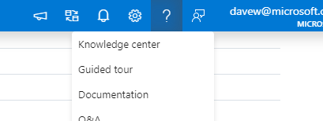

## Synapse Family of Products

Azure Synapse Analytics (workspaces) is a web-native experience that unifies end-to-end analytics solutions for Data Engineers to empower and enable them to ingest, explore, prepare, orchestrate, and visualize their data through one experience by utilizing either SQL or Spark pools. Additionally, it brings along with it the capabilities for debugging, performance optimization and integration with CI/CD.  

Key service capabilities include:

* Unified analytics platform
* Serverless and dedicated options
* Enterprise data warehouse
* Data lake exploration
* Code-free hybrid data integration
* Deeply integrated Apache Spark and SQL engines
* Cloud-native HTAP
* Choice of language (T-SQL, Python, Scala, SparkSQL, & .NET)
* Integrated AI and BI


## Success Criteria

1. Spin up a workspace in your Azure Subscription 
    * this only needs to be done by 1 member of the team and everyone can share that workspace
1. Add other users/team as needed to the workspace.  Process:
    * Assign them to the Contributor role on workspace
    * Assign them to a Workspace, SQL, or Spark admin role using Synapse Studio
    * Assign yourself and others to the Storage Blob Data Contributor role on the storage account 


## Optional: Setup a Spark Pool

Make sure you setup auto-pause to control costs.  

If you do this you need to configure security so the spark pool can connect to the storage account
* Assign the workspace MSI to the Storage Blob Data Contributor role on the storage account
* Assign the team to the Storage Blob Data Contributor role on the storage account


## Questions

* When would it be a good idea to have multiple workspaces? 

## Next Steps

You can do this later on your own but I think the `Knowledge Center` in Synapse Studio is a great way to get started with Synapse by looking at some of the samples and patterns.  You can reach this by clicking `Help|Knowledge Center`.  




## Automation

TODO:  this still throws a lot of errors but nothing appears to be critical.  Just follow instructions below

1. Open Azure CloudShell  and run the following

```powershell
# clone our repo to an area of Azure Cloud shell where we can put git repos
mkdir git
cd git
git clone <this repo> synapse

# set vars
cd synapse\environment-setup\automation
$subscription="davew demo"
$rg="davew-synapse"
$location="East US"


#Install-Module -Name Az -Scope CurrentUser -Repository PSGallery -Force

# change values as needed
# Connect-AzAccount 
Set-AzContext $subscription

New-AzResourceGroup `
    -Name $rg `
    -Location $location

New-AzResourceGroupDeployment `
    -ResourceGroupName $rg `
    -TemplateFile "00-asa-workspace-core.json"

# create the SQLPool01 dedicated pool (something wrong with the script above)=
# DW100c should be sufficient
# and create SparkPool01

./01-environment-setup.ps1
```