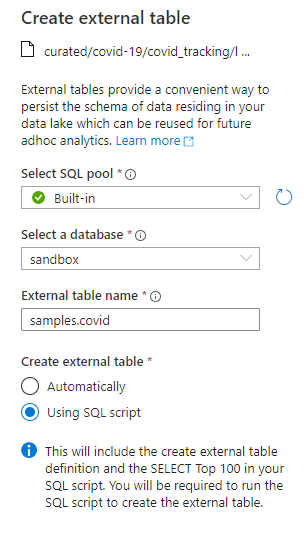

## Lab 002 import sample data into Synapse

We want to gain experience with the Synapse workspace UI.

1. Open Synapse studio
1. Go to `Data` section, expand `+`, then `Browse Gallery`
1. Bring in `Covid Tracking Project` 
1. This creates a "link" to the dataset, it does not import it.  

>> Note:  This is a very valuable feature.  Often you will need to connect to other data lakes (or storage accounts) that hold valuable data and you really don't want to waste time importing the data.  This quick trick will add a pre-defined linked blob storage account.  In a later lab you will connect to my data lake and query that as though it was a `data marketplace`.  

1. `Select TOP 100 Rows`.  Note:  the file is in parquet format and we are opening the file from the _public_ data lake using a Serverless SQL Pool.  
1. Now load the data into our data lake using `CREATE EXTERNAL TABLE` on the context menu.  

>> This is another valuable trick.  I can point an EXTERNAL TABLE at any linked service.  This gives me a quick SQL abstraction, much like a view, that I can use to do quick SQL queries.  I always create a database called something like `sandbox` where I keep all of my external tables (views).  I also save the DDL as a SQL script so I have a record of the code that I can save and share.  

I have this file saved to [my scripts folder](./scripts/samples-covid.sql).  We will build on this folder structure in subsequent labs.  

