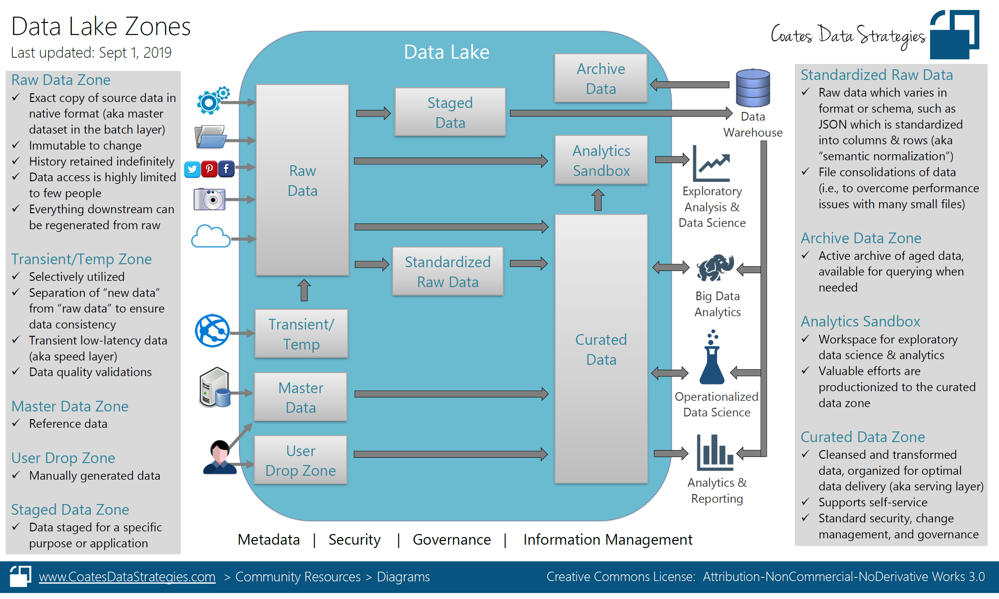
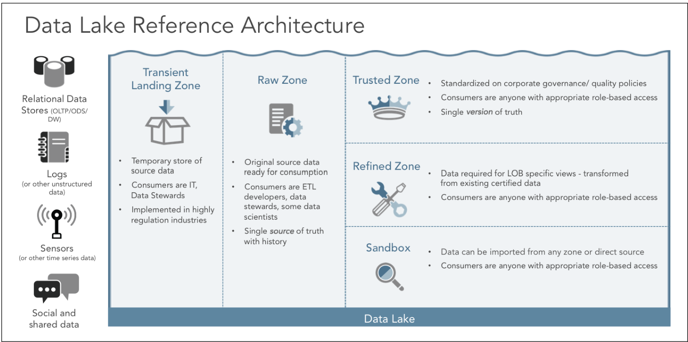
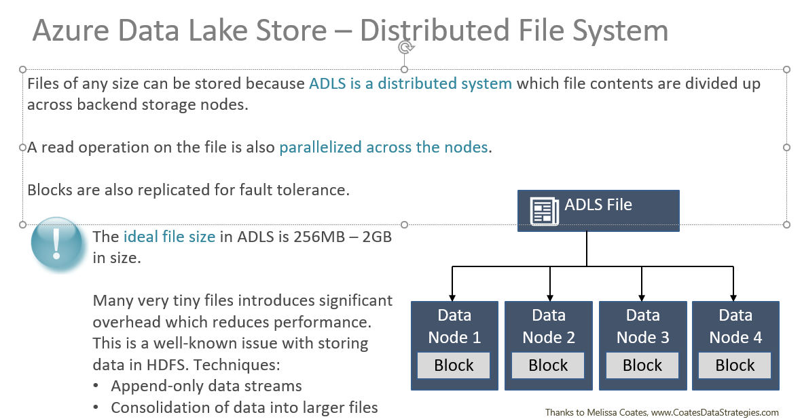

## How might you structure your datalake?  

...an alternative view...

This lab is designed to be a discussion, there is no real work to do.  We want to determine what are some common ways to logically and physically lay out a data lake.  

First, there are primarily two types of data stored in a data lake:
* Transactional
  * Example:  streaming data, orders data
  * a given business transaction may emit multiple transaction records as the business transaction evolves
  * always send the full-fidelity business transaction ("the entire row").  Never send just the changes.  The row must be `idempotent`.  
* Snapshot
  * the state of an object at a given point of time.  
  * Example: a snapshot of the orders table as of midnight

Let's start with a sample of what a typical data lake _might_ look like:  

## A Sample Folder Structure

|Path|Purpose| Format|Type| ACL|Requires Partitioning?|
|---|---|---|---|---|---|
|`/dev/...` and `/prod/...`| Environment denotation. Should you have separate dev and prod areas in your data lake?  Or 2 separate data lakes? See below.  _We omit the environment for the remaining examples_| ||User: rx
|`/landing/<source>/<object>`| the landing zone for all all data first entering the lake.  **Never** do ETL BEFORE landing the data.  **Never**.  **Resist the urge**.  The extract should be "light touch" and as close to the source as possible for later auditing.  |Use the format closest to the source data.  If API data, then JSON, if SQL Server, then avro/json.  Generally, do NOT use parquet, unless the source is parquet.  |Transactional|Scheduler:w, User:rx|YES
|`/sandbox/landing/<source>/<object>`  or  `dev/landing/<source>/<object>`| this would be where we do development, before the code is approved and moved to the above structure (by the DevOps team)|see above |Transactional | Devs: w, Users:, Scheduler: w
|`/sandbox/<user>`|This is the "home" folder for each user.  Anything the user creates should, by default, be stored here. Generally tell your users this will be purged on the 1st of every month so they save their scripts elsewhere|varies, but probably parquet| |Users:rwx
|`/raw/<source>/<object>`|The next step after `landing`.  A light amount of ETL is applied to remove duplicates, do basic normalization, business key management, etc. In some cases you may want to skip either `raw` or `landing` depending on the use case|Since this is still transactional, consider json or avro. Parquet rarely.| Transactional|Users:rx, Scheduler:w|YES
|`/bronze/<source>/<object>`  or  `/bronze/<ds name>`|This is the first dataset that is "certified" for general consumption.  There are many ways to organize this, but generally if a dataset or even a source table or object is queryable, then it should go here|Parquet|Snapshot|Scheduler:w, User:rx|Maybe
|`/silver/<object>`|`silver` is aggregated or summarized bronze data.  The bulk of users will want to use this data|Parquet|Snapshot|Scheduler:w, User:rx|Not likely
|`/gold/<object>`|`gold` is further aggregated.  Often `gold` is the convention for the EDW source data. |Parquet|Snapshot|Scheduler:w, User:rx|Not likely
|`/platinum/<object>`|`platinum` is the data that we use for real-time dashboarding, KPIs|Parquet|Snapshot|Scheduler:w, User:rx|Not likely
|`/badfiles/raw/<source>/<object>`|Any **files** that were malformed, etc. These should be caught by your load tool and alerting sent.  Requires human intervention||||
|`/errors/raw/<source>/<object>`|Any **rows** that did not pass Stage-Audit-Publish. Requires human intervention||||
|`/models`|ML model storage||||
|`/results`|Results from ML model training||||
|`/training_data`|ML model training data||||

Some considerations:  
* from a dbx perspective everything likely starts with `/mnt` but you rarely actually put that path in your actual persisted data.
* do you want `/prod` and `/dev`?  
  * generally I say no. It makes the paths longer.  
  * so do you do dev in a dev datalake or right in prod?  
    * I say directly in the prod datalake but as part of a `sandbox`
* understand the difference between transactional data and snapshot data
* Should you have `landing` and `raw`?  What's the difference?  
  * some ppl also call this `curated`
* Should there be data lifecycling?  
* a data dictionary/catalog should be *mandatory* to prevent he data swamp.  Consider ADC.  
* LIGHT data governance is better than heavy-handed ACLing, regulatory requirements not withstanding.  HEAVY data governance does not foster a collaborative culture and "Citizen Data Scientists".  
  * If the concern is PII/PHI in the data lake then the simple solution is **DON'T LOAD THAT DATA**.  Or deidentify it.  Or load it to a separate structure and use alternate `homomorphic-like` keys.  
* **Never compress files**.  Most file formats like avro and parquet have native compression.  That's OK.  Don't further try to use gzip or bzip.  It makes no sense to compress a file and then have to explode it to do analytics.  Yes, some compression types are "splittable" and can be smartly exploded, this still makes no sense.  Storage is cheap, processing is not.  

## File Formats

There are thousands of file formats.  That doesn't mean you should use them.  Consider JSON or avro for transaction data and parquet/delta for snapshot data.  Have a company standard and stick to it.  Just because python is really good at using `HDF5` files doesn't mean Power BI is.  

## Alternative Structures

* `/projectname/raw-files/source/object`
  * I don't like this b/c it assumes a given source is used for only one project and makes finding files difficult.  

## Partitioning

* Pick a partitioning pattern company-wide and try to make it a standard.  This makes common libraries and query patterns easier.  
* I _formerly_ preferred something like `/raw/sap/VCUR/2019/12/12/000000`
* Parquet, Delta, and most of the open source community seems to be standardizing on `/raw/sap/VCUR/year=2019/month=12/day=12/HH=00/MM=00/SS=00`

## Interesting Patterns

### You receive full feeds nightly and need to construct the daily transaction file

TODO

### You receive minutely transaction data and need to construct up-to-date snapshots

### Kappa vs Lambda Architectures

