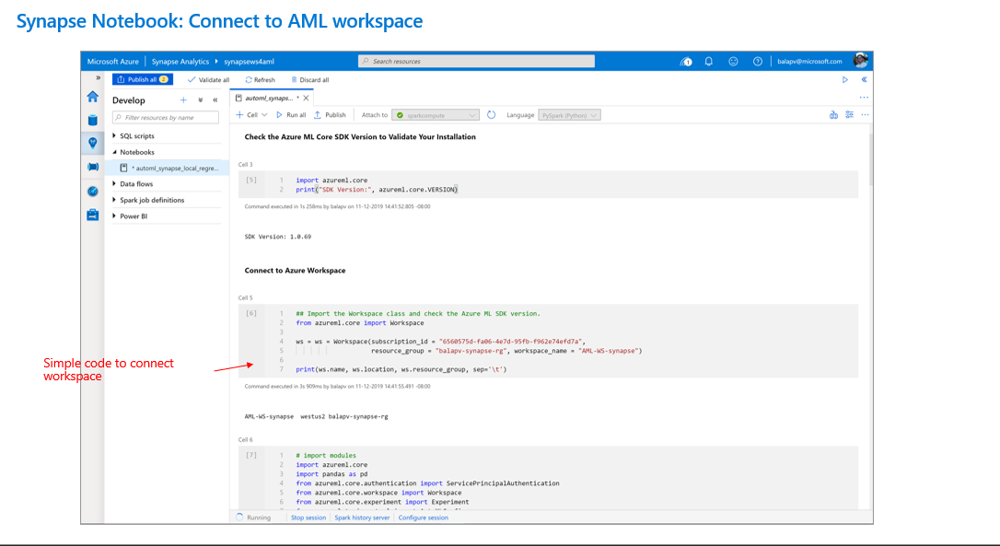
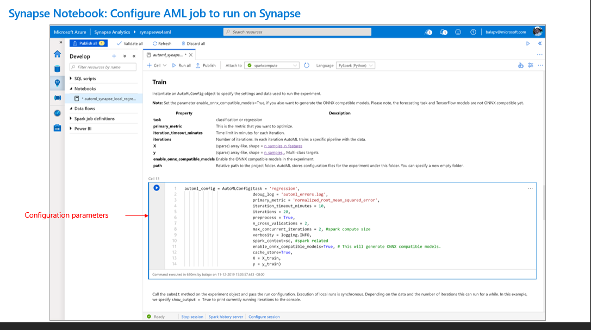
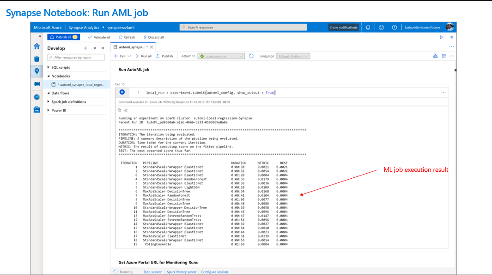

## ML Models in Synapse

Quick Overview:








Using Azure Synapse Analytics, data scientists are no longer required to use separate tooling to create and deploy machine learning models.

In this exercise, you will create multiple machine learning models. You will learn how to consume these models in your notebook. You will also deploy a model as a web service to Azure Container Instances and consume the service.

### Task 1: Create a SQL Datastore and source Dataset

1. Open the lab resource group, locate and open the **amlworkspace{{suffix}}** Machine Learning resource.

    

2. On the **Overview** screen of the Machine Learning resource, select the **Studio web URL** link.

    

3. From the left menu of **Azure Machine Learning Studio**, select the **Datastores** item.

    

4. On the **Datastores** screen top menu, select **+ New datastore**.

5. On the **New datastore** blade, configure it as follows and select **Create**:

    | Field | Value |
    |--------------|---------------|
    | New datastore (name) | sqlpool01 |
    | Datastore type | Azure SQL database |
    | Account selection method | From Azure subscription |
    | Subscription ID | Select the lab subscription. |
    | Server name / database name  | Select asaworkspace{{suffix}}/SQLPool01. |
    | Authentication type | SQL authentication |
    | User ID | asa.sql.admin |
    | Password | The SQL Admin password you chose when deploying the lab resources. |

    

6. From the left menu, select **Datasets**, and with the **Registered datasets** tab selected, expand the **+ Create dataset** button and select **From datastore**.

    

7. In the **Create dataset from datastore** Basic info form, name the dataset **AggregatedProductSeasonality** and select **Next**.

    

8. On the **Datastore selection** form, select **Previously created datasource**, choose **sqlpool01** from the list and select the **Select datasource** button.

    

9. In the next **Datastore selection** form, enter the following **SQL query**. Then expand the **Advanced settings** and enter **100** for the **Query timeout (seconds)** value. Select **Next**:

    ```sql
    SELECT  P.ProductId,P.Seasonality,S.TransactionDateId,COUNT(*) as TransactionItemsCount
    FROM wwi_mcw.SaleSmall S
    JOIN wwi_mcw.Product P ON S.ProductId = P.ProductId
    GROUP BY P.ProductId ,P.Seasonality,S.TransactionDateId
    ```

    

10. The **Settings and preview** data table will be displayed after a few moments. Review this data, then select the **Next** button.

    

11. Review the **Schema** field listing, then select **Next**.

    

12. On the **Confirm details** screen, select **Create**.

    

### Task 2: Create compute infrastructure

1. From the left menu of Machine Learning Studio, select **Compute**.

2. On the **Compute** screen with the **Compute instances** tab selected. Choose the **Create** button.

    

3. On the **Create compute instance**, **Select virtual machine** form, configure it as follows, then select **Next**:

    | Field | Value |
    |--------------|---------------|
    | Virtual machine type | CPU |
    | Virtual machine size | Search for and select Standard_DS3_v2. |

    

4. On the **Configure Settings** form, enter a globally unique **Compute name** of your choice, and select **Create**.

    

5. Select the **Compute clusters** tab, and select **Create**.

6. On the **New compute cluster**, **Select virtual machine** form, configure the virtual machine as follows, then select **Next**:

    | Field | Value |
    |--------------|---------------|
    | Virtual machine priority | Dedicated |
    | Virtual machine type | CPU |
    | Virtual machine size | Search for and select Standard_DS3_v2. |

    

7. On the **Configure Settings** form, configure it as follows, then select **Create**:

    | Field | Value |
    |--------------|---------------|
    | Compute name | automlcluster |
    | Minimum number of nodes | 0 |
    | Maximum number of nodes | 3 |
    | Idle seconds before scale down | 120 |

    

### Task 3: Use a notebook in AML Studio to prepare data and create a Product Seasonality Classifier model using XGBoost

1. In Azure Machine Learning (AML) Studio, select **Notebooks** from the left menu.

2. In the **Notebooks** pane, select the **Upload** icon from the toolbar.

    

3. In the **Open** dialog, select **Hands-on lab/artifacts/ProductSeasonality_sklearn.ipynb**. When prompted, check the boxes to **Overwrite if already exists** and **I trust contents of this file** and select **Upload**.

    

4. In the top toolbar of the notebook, expand the **Editors** item, and select **Edit in Jupyter**.

    

5. Review and run each cell in the notebook individually to gain understanding of the functionality being demonstrated.

>**Note**: Running this notebook in its entirety is required for the next task.

### Task 4: Leverage Automated ML to create and deploy a Product Seasonality Classifier model

1. In Azure Machine Learning (AML) Studio, select **Experiments** from the left menu, then expand the **+ Create** button, and select **Automated ML run**.

    

2. In the previous task, we registered our PCA dataframe (named **pcadata**) to use with Auto ML. Select **pcadata** from the list and select **Next**.

    

3. On the **Configure run** screen, select the **Create a new compute** link beneath the **Select compute cluster** field.

4. Back on the **Configure run** form, name the experiment **ProductSeasonalityClassifier**, select **Seasonality** as the **Target column** and select **automlcluster** as the compute cluster. Select **Next**.

    

5. On the **Select task type** screen, select **Classification**, then choose **Finish**.

    

6. The experiment will then be run. It will take approximately 20-25 minutes for it to complete. Once it has completed, it will display the run results details. In the **Best model summary** box, select the **Algorithm name** link.

    

7. On the Model run screen, select **Deploy** from the top toolbar.

    

8. On the **Deploy a model** blade, configure the deployment as follows, then select **Deploy**:

    | Field | Value |
    |--------------|---------------|
    | Name | productseasonalityclassifier |
    | Description | Product Seasonality Classifier. |
    | Compute type | Azure Container Instance |
    | Enable authentication | Off |

    

9. Once deployed, the Model summary will be displayed. You can view the endpoint by selecting the **Deploy status** link.

    

10. Review the details of the deployed model service endpoint.

    