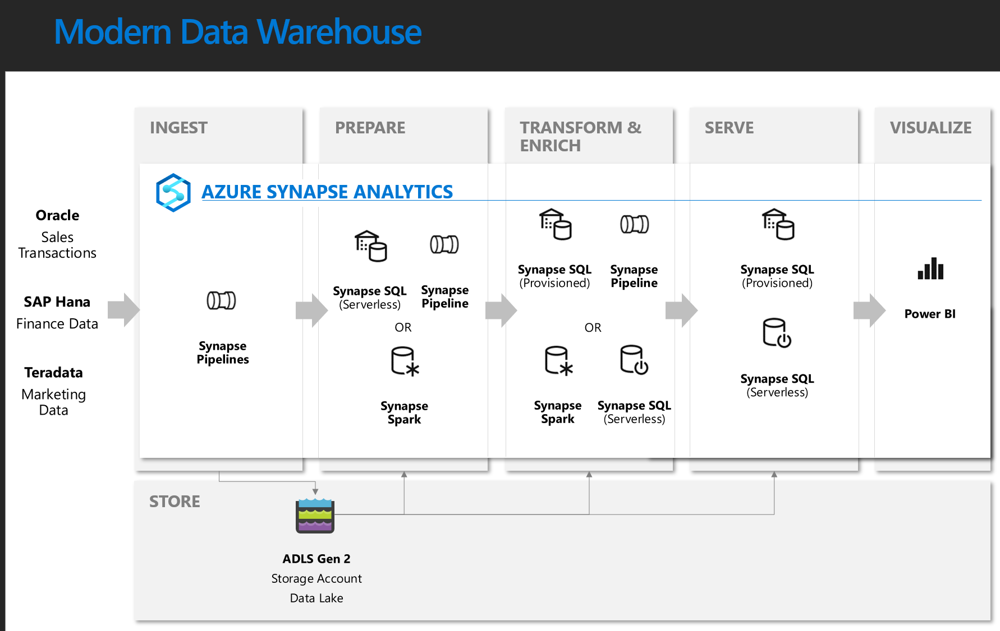
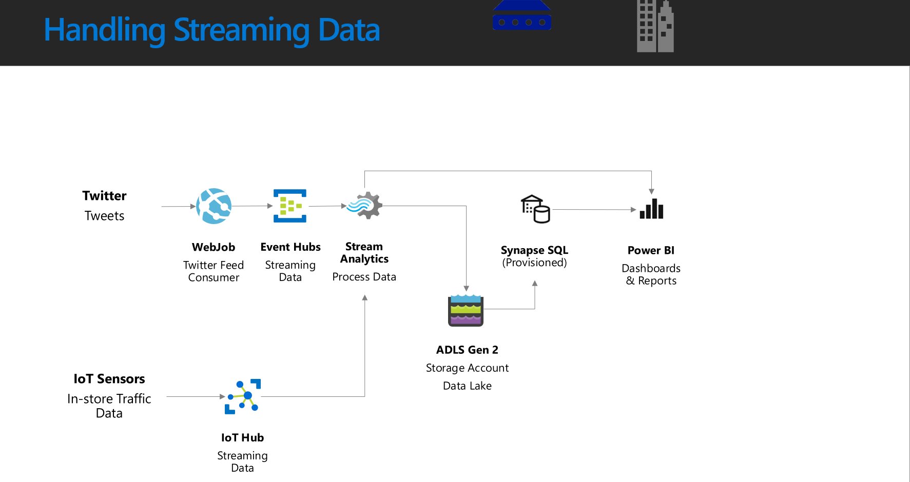

# Synapse End to End Workshop

https://git.davewentzel.com/workshops/synapse

## What Technologies are Covered

* Synapse workspaces
* Azure DevOps (AzDO) or GitHub (and gh actions)
* pretty much every other Azure data service

## Target audience

-   Data Engineers/DBAs/Data Professionals
-   Data Scientists
-   App Developers

## Business Case Background

Our company has hundreds of brick and mortar stores. Over the years, they have amassed large amounts of historical data stored in disparate systems.  They wish to combine their historic data and tie it together with near real-time data streams to produce dashboard KPIs and machine learning models that enable them to make informed up to the minute decisions.

Our company has over 5 years and 30 billion rows of transactional sales data in Oracle, finance data stored in SAP Hana, and marketing data in Teradata. They also monitor the data coming in from their social media Twitter account.

They need a solution that allows them to query across and analyze the data from all these sources. Regardless of volume, they want these queries to return in seconds.

Our company has 100 stores each equipped with 50 IoT sensors that monitor customer behavior in the store aisles. They need to ingest sensor data in near real time to allow them to quickly identify patterns that can be shared between stores in an aim to improve sales with last minute offers and improved product placement.

## Workshop Objectives

we will try to build an end-to-end solution using Azure Synapse Analytics. The workshop will cover:
* data loading
* data preparation
* data transformation
* data serving
* machine learning
* batch data
* streaming data

We will try to do everything using the same datasets, but can't guarantee it.  

We want to build something like this:

... this is a "reference architecture" for a standard `corporate information factory` which focuses on a Synapse-based implementation (aka "SQL-focused" solution).  But this of course is not the only way to do things.  In fact, if you want to think of your data in terms of "streams" this may be a better way to think of your data:

...note that here we are using other technologies to process the stream data before it "comes to rest".  These are not the ONLY technologies to process streaming data, in fact, they may not even be the best.  

## What is Synapse Data Warehouse?

See [Synapse Workspace](./synapse.md)

## Workshop Agenda

### Setup and Prep Labs

| Topic | Lab Name | Description|
|------|------|------|
|Setup|[Lab 000: local development machine setup](./Lab000.md)|You will need some tools installed on your local machine. Let's get those setup.  |
|Setup|[Lab 001: setup Synapse workspace](./Lab001.md)|understand a little more about what problems this service is trying to solve|
|Setup|[Lab 001a: Setup Source Control Integration](./Lab001a.md)|Never work in Synapse Live Mode|
|Setup|[Lab 021: Version Control Integration](./Lab021.md)|general best practices when doing Synapse browser-based development|
|Setup|[Lab 002: import sample data into Synapse](./Lab002.md) |get familiar with the workspace UI.  |
|Setup|[Lab 003 (Optional): Configure additional users to access a Synapse workspace](./Lab003.md)|You do not need to do this unless everyone in the workshop wants to share access to a single Synapse workspace.  |

### Working with Linked Services
* [Lab 005: creating a linked service to another storage account](./Lab005.md) 
  * skip this lab for now.  

### Data Discovery and Sandboxing

Understanding data through data exploration is the biggest challenge faced today by data professionals.  Generally I do data exploration using either:
* Synapse serverless SQL pool
  * I'm good at SQL so I want to use this to start my analysis, plus, it has a wicked-cool UI for exploring data lake files
* Spark (databricks or Synapse Spark)
  * If I realize I need something more complex for analysis like python or pandas, or I need to do some ML.  

| Lab Name | Description|
|------|------|
|[Lab 010: Understanding Data Lakes](./Lab010.md) |An overview of the structure and purpose of a data lake|
|[Lab 011: Data Discovery and Sandboxing with SQL Serverless](./Lab011.md) |we also look at querying CSV and JSON data|
|[Lab 012: Data Discovery and Sandboxing with Spark](./Lab012.md) |<li>we do basic data lake queries using Spark<li>we will use Lab 052 for a much deeper dive later|
|[Lab 020: Shared Metadata](./Lab020.md)|the 3 components of a Synapse Workspace share much of their metadata to aid in reuse.  We explore that in this lab.  |
|[Lab 030:  Logical Datawarehousing with Synapse Serverless and your Data Lake](./Lab030.sql)|open the sql file on the link in Synapse workspace and follow along|
|[**Thinking about how to leverage your data lake to do ETL with TSQL and Serverless**](./etl_patterns.md)||
|[Lab 031: ETL with Synapse Serverless, your data lake, and TSQL](./serverless_etl.sql)||
### ETL/ELT Options

There are a lot of different ways to do ELT/ETL using Synapse.  We'll explore each way in this section:  

| Topic | Lab Name | Description|
|------|------|------|
|General Setup|[Lab 050: Understanding Data Factory (Integrate) Best Practices](./Lab050.md)|Even if you are not planning to use ADF/Synapse "Integrate" experience, you will likely want to version control your notebooks and SQL files.  We cover things like gitflow as well.|
|General Setup|[Lab 051: Best Practices for source controlling SQL scripts](./Lab051.md)|Let's walk through what I think is THE BEST WAY to think about how to do data lake-driven ETL.|
|Spark|[Lab 052:  Manipulating a Data Lake with Spark](./notebooks/Lab052.ipynb)|  <li> Import `./notebooks/Lab052.ipynb` directly in your Synapse workspace under Notebooks. <li> Read the instructions and complete the lab|
|Spark|[Lab 053:  Understanding Delta Tables with Spark](./notebooks/Lab053.ipynb)|We'll explore using Delta tables from Synapse Spark pools TODO|
|Spark|[Lab 054: Sharing Data Between SparkSQL, Scala, and pySpark](./notebooks/Lab054.ipynb)|Using multiple languages in Spark is the key to solving problems, but sharing variables and dataframes isn't always intuitive.  We'll also look at how to persist data so Serverless Pools can access it. WIP/TODO...see version in workspace|
||||
||||

#### Using SQL Serverless
* [Lab 055: Writing a SQL Script to copy data from one data lake zone to another](./Lab055.md)  
  * we use Serverless as a SQL-based ELT tool

### Spark to Synapse Dedicated Pools
* [Lab 056: Using Spark to write data into Synapse SQL Pools (Dedicated)](./Lab056.md)
* [Lab 056a: Using Spark to write data into Synapse SQL Pools - .NET version](./Lab056a.md)

### The ADF (Integrate) box-and-line tools
* [Lab 057: Loading Data from a Data Lake into Synapse SQL Pool using the "Integrate" box-and-line experience (ADF Copy Activity)](./Lab057.md) 
* [Lab 058: Loading Data from a Data Lake into Synapse SQL Pool using the "Integrate" box-and-line experience (ADF Dataflows)](./Lab058.md) 

TODO:  load campaign analytics table, might be good for ADF data flows.  

### Power BI Integration

* [Lab 100: Create and Use a Power BI dataset](./Lab100.md)

### Security Topics

* [Lab 300: Column Level Security in Synapse](./Lab300.md)
* [Lab 301: Row Level Security](./Lab301.md)
* [Lab 302: Dynamic Data Masking](./Lab302.md)

### ML/AI in Synapse

* [Lab 400: Consuming a Model in Synapse](./Lab400.md) TODO
* [Lab 410: Using Cognitive Search with Synapse](./Lab410.md) TODO
* [Lab 420: Basic ML lifecycle using Spark and Synapse Dedicated Pools](./Lab420.md)  
* [Lab 421: Train an automl model against an existing Spark dataset](./Lab421.md)
  * this requires you to complete Lab420.
* [Lab 422: Use an existing model to batch inference against Synapse Dedicated Pool data](./Lab422.md)
  * this requires you to complete Lab 420 and Lab 421

### Monitoring

* [Lab 600: Workload Management](./Lab600.md)

## Wrap Up

You should probably delete the resource group we created today to control costs.  

If you'd rather keep the resources for future reference you can simply PAUSE the dedicated SQL Pool and the charges should be minimal.  

## Other Notes

* [templates folder](./templates) has a bunch of my patterns that you may be able to leverage