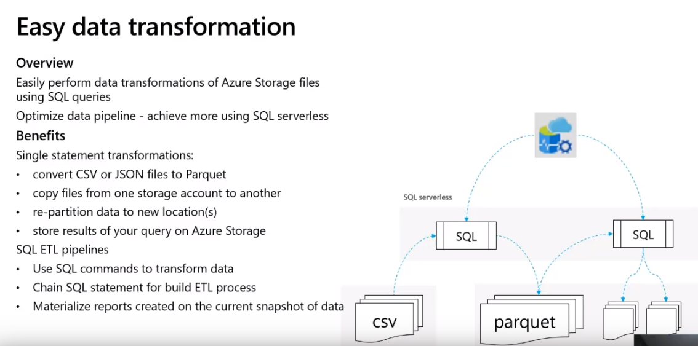
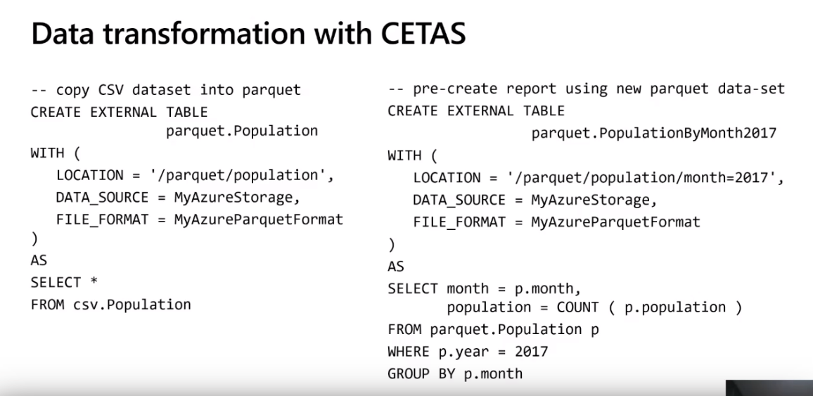

## Data Lake-driven ETL Development

this is wip

Here is the high-level process.  We are going to "chain" together a bunch of SQL statements to semantically-enrich our data.  At each step of the process we will write out the data to an area of our datalake.  Like this:  

Diving deeper, the SQL statements will following a pattern like this:  

Now, let's build out the pattern.    

Let's assume the following:

* we want to use SQL to do as much ETL as we can.  SQL is easy for most people, and we want to provide a process and patterns that folks can use to build repeatable, supportable ETL pipelines.  
* The pattern should be usable in both Synapse or Databricks.  
* We have an area of our datalake where we are ingesting raw csv data for a dataset called `Population` (don't worry about what that is right now).  
  * assume the folder structure looks something like this:  `/raw/population/year=2021/month=01/day=03`
  * based on that structure we can deduce we are receiving a new csv file every day containing the previous day's data.  

Initial load on the left side of the diagram:  

  * We build a view called `csv.Population` that maps to the root of that folder structure: `/raw/population`  
* CSVs are obnoxious and slow, the first set of code above is building a new `EXTERNAL TABLE` that 
  * reads all of the EXISTING csv data in `/raw/population` as of the time the script is run (or, re-run)
  * copies the data to `/parquet/population` in parquet format.  
  * Builds a view against that filepath called `parquet.Population`
* as written, the output will be one large parquet file.  That's probably suboptimal so we might consider partitioning, but let's keep this simple.  

Incremental loads:

Again, this is wip, but the pattern is:

* at the beginning of our nightly load script we create a TEMPORARY external table that is PARAMETERIZED that looks at the data you want to read out of the previous area of the lake
* we do whatever semantic enrichment we need to do
* Note that our external table above is a subset of the larger external table.  That's fine and that is the trick.  