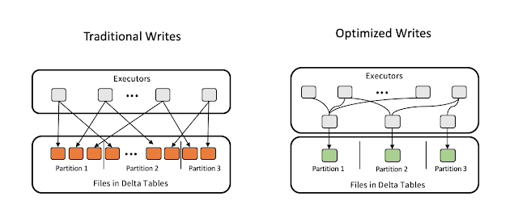

# Synapse Performance Notes

## General Performance Best Practices

* [Optimize Synapse Spark Performance Overview](https://learn.microsoft.com/en-us/azure/synapse-analytics/spark/apache-spark-performance)
* [Hyperspace Indexes](https://learn.microsoft.com/en-us/azure/synapse-analytics/spark/apache-spark-performance-hyperspace?pivots=programming-language-python):  not on 3.3

### Storage Optimized Clusters

Spark processes data in-memory and most folks are using ADLS.  They therefore think disks are inconsequential.  Not true.  If you have a shuffle data problem then the data will spill from the executor/worker.  In this case you should consider storage-optimized clusters.  

### General Cluster Settings

* Use (or not) the [Intelligent Cache](https://learn.microsoft.com/en-us/azure/synapse-analytics/spark/apache-spark-intelligent-cache-concept).  This is the equivalent of [Databricks' Delta Cache]([See this documentation](https://docs.microsoft.com/en-us/azure/databricks/delta/optimizations/delta-cache)  )
* Use [Synapse Genie](https://github.com/microsoft/SynapseGenie/tree/main) to optimize Spark pool utilization.  
  * Eliminates the need to configure node types and sizes per notebook.
  * Enables notebook activation and/or removal from pipeline through metadata.
  * Enables global views, user-defined functions (UDFs), and usage across notebooks.
  * Prevents small notebooks from hogging resources unnecessarily.
  * Puts a stop to long running notebooks from delaying other unrelated notebooks.
  * **This REALLY helps with performance and costs**
* [autoscale and dynamic execution](https://learn.microsoft.com/en-us/azure/synapse-analytics/spark/apache-spark-autoscale)

### Set an appropriate number of shuffling partitions 

By default the `spark.sql.shuffle.partitions` setting is to 200, which may not be sufficient for most big data scenarios. (See Lab 4xx for examples).  If you have a large configured Spark cluster for your big data workload, but still have the number of shuffling partitions set to the default, it will result in slow performance, data spills and some of the worker's cores not being utilized at all (but you will still be charged for them).

So, in order to increase the number of shuffling partitions, i.e. split your processing data into smaller data files, you will need to increase the number of partitions. The formula for this is pretty easy:

`Number of Shuffling Partitions = Volume of Processing Stage Input Data / 128Mb`

Some people, also recommend to keep Shuffle Stage size between 128 Mb and 200 Mb, but not more than that.

### Files and Tables

* use compressed files.  There is no reason not too.  
  * Use something like gzip which actually is splittable when using parquet (b/c parquet is always splittable). 
  * dbx natively understands gzip, it's not clear if dbx understands bzip. 
  * splittable-ness isn't always a concern as long as you have a decent enough number of files b/c the engine will have enough threads to work on all of the files anyway.   
* try to use parquet whenever possible.  Or, even better, delta, if you can. 
* internal tables take longer to create than external tables.  But if they will be used a lot then make them internal.  
* all internal tables should be parquet
* always use `ANALYZE TABLE` (similar to update stats in SQL Server) after a data load.  Takes a miniscule amount of time.  
* use aggregated views
  * always use caching
  * never use partitioning

### Partitioning

* partitioning yields fantastic performance if your query does not span multiple partitions, otherwise partitioning may actually be a bit slower.  Design your partitions around expected queries.  
* joins:  partition on the join column if you can.  
* aggregated views:  probably should not use partitioning in this case.

### JOINs

In general a broadcast join is much better than a SortMerge join.  Broadcast is used when a big table is joined to a small table.  (See Lab 4xx for examples).  

Partition on the join column if you can.  

## Monitoring Spark

[Overview](https://learn.microsoft.com/en-us/azure/synapse-analytics/spark/apache-spark-history-server)

## Delta Settings

* Use [Synapse Genie](https://github.com/microsoft/SynapseGenie/tree/main/utilities/DeltalakeAutoMaintain) to auto-maintain your delta lake.  
* [Enable Optimized Write setting](https://learn.microsoft.com/en-us/azure/synapse-analytics/spark/optimize-write-for-apache-spark)

### Use Auto Optimize

Larger files (> 128 MB) are better for delta tables.  [See this](https://docs.microsoft.com/en-us/azure/databricks/delta/optimizations/auto-optimize).  

Consider these settings in your current Spark session:

`spark.databricks.delta.optimizeWrite.enabled true`  
`spark.databricks.delta.autoCompact.enabled true`  

Or design this directly in your tables, like so:

`ALTER TABLE [table_name] SET TBLPROPERTIES (delta.autoOptimize.optimizeWrite = true, delta.autoOptimize.autoCompact = true)`  

The number of data files will be reduced with respect to optimal performance.  

Also, I can execute the Optimize command manually for a particular table:

`OPTIMIZE [table_name]`

[See this](https://docs.microsoft.com/en-us/azure/databricks/spark/latest/spark-sql/language-manual/optimize).  

### Use `VACUUM` judiciously

The `VACUUM` command will remove data files that are no longer used by your delta tables which still consume disk space in your data lake storage. The files become unused, for instance, after an `OPTIMIZE` operation.  Those unused files may also result from other data update/insert (upserts) operations.  
`VACUUM [table_name] [RETAIN num HOURS]`

[See this](https://docs.microsoft.com/en-us/azure/databricks/spark/latest/spark-sql/language-manual/vacuum)   

-----
  

* Look in the DAG of a running job, under Storage, `Fraction Cached` should be 100% otherwise we are spilling to disk.  Solution is a larger-sized cluster for the job.  

## Pandas and Databricks

Pandas dataframes will only scale up to the computing resources of the driver node.  They are not distributed.  You have options:  

* migrate the pandas code to a full spark dataframe.  This requires learning the paradigm and rethinking your code.
* leverage pandas UDF.  It tries to leverage what you have, but still requires you to understand distributed computing.
  * aka "vectorized UDFs"
* use koalas which tries to automate it all, but this is still early stage.  

* DataFrames are faster than RDDs

**this is specific to Databricks, but the concepts are very similar**
## Performance Tuning Spark and Databricks

* you only need a small cluster for these labs.  2 worker nodes is sufficient.  
* some code _will_ run long, by design
* take each .ipynb file for each lab and upload to your workspace.  
* the labs build on each other and should be run in order
* **This series of Labs is not fully-baked from me.  I hope you find this useful.  Feel free to suggest modifications (especially to the documentation).  Even better:  issue a PR to the repo.**

* [Lab 400: Looking at the SparkUI and the Query Plan using "small" data](./Lab400/400.ipynb)
* [Lab 401: Looking at Larger Datasets](./Lab400/401-Setup-Large-Dataset.dbc)
  * this lab deals with optimizing Spark tasks
* [Lab 402:  Partitions and Shuffling](./Lab400/402-Partitions.ipynb)
  * we look at how partitions affect shuffling and why shuffling affects performance
* [Lab 403:  Caching and Partitioning](./Lab400/403-Caching-and-Partitioning.dbc)
  * Caching is valuable if you are going to reuse a dataset during your analytics.  We'll show you how to tune caching and other considerations.  
* [Lab 404:  SortMerge and Broadcast JOINs](./Lab400/404-SortMerge-and-Broadcast-Joins.dbc)
  * we go over which is better in certain circumstances, and how to experiment
* [Lab 405:  Multi-table JOINs](./Lab400/405-Multi-Table-Joins.dbc)
  * when dealing with joins among BIG tables...things get interesting and JOIN order matters
* [Lab 406:  Data Skew](./Lab400/406-Data-Skew.ipynb)
  * data skew can wreck performance.  We'll show you what the symptoms are, as well as some creative solutions.  
* [Lab 407:  Delta Tables](./Lab400/407-Delta-Tables.dbc)
  * background info on delta tables
  * how to optimize them in various scenarios
* [Lab 408: Files Formats and Effects of Compression](./Lab400/408-FileFormats-and-Compression.dbc)
  * which file formats are compressible and a demonstration on the impact on performance
