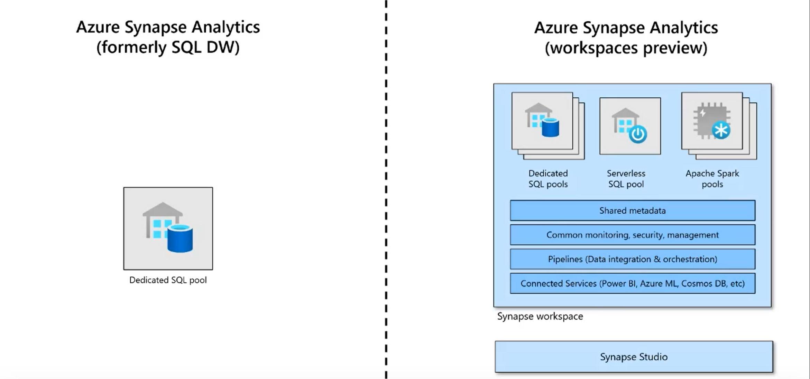
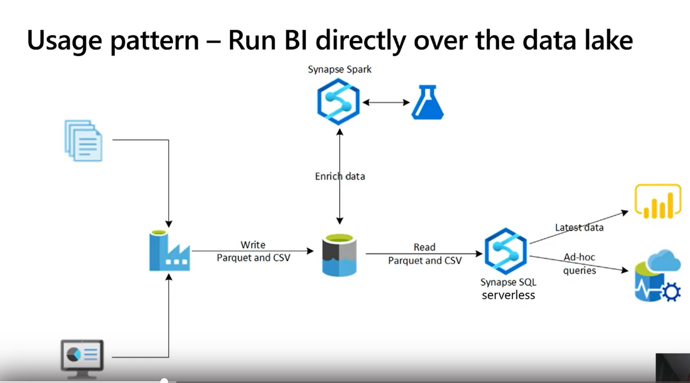
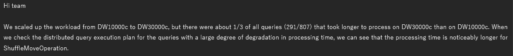

## A Quick, non-powerpoint, Overview of Synapse

Synapse (nee SQL DW), is a bunch of different services that are accessible under the same umbrella.  

First, when talking about Synapse we have to understand the 2 major services and the differences between them:  

| Topic 	| Serverless SQL Pools 	| Dedicated SQL Pools |
|-	|-	|-|
| Main Purpose 	|allows you to run interactive queries against files in a Data Lake  	| MPP, EDW workloads 	|
| Other Scenarios 	| data exploration  	|  	|
| Schema-on-Read	| Yes  	| No 	|
| Logical Data Warehouse	| Yes  	| No 	|
| Can be used for ETL	| Yes  	| Yes, but not optimally 	|
| Languages 	| Standard T-SQL 	| Modified T-SQL (D-SQL?) 	|
| AKA 	| Serverless, OnDemand  	| nee SQL Data Warehouse 	|
| AutoScale 	| based on query  	| either manually or via automation 	|
| Billing Model 	| PayPerQuery  	|  DWU	|
|  	|   	|  	|

Synapse also supports Apache Spark Pools.  

## SQL OnDemand Pools

aka, "Serverless", has a lot of use cases, but it's easiest to think of it as "the compute engine that allows you to run queries over your data lake":

## Dedicated SQL Pools

Here is the architecture:  

* Regardles of DWU there are always 60 databases spread out over x worker nodes.  x is _usually_ equal to DWU/100.  So DWU100 is 1 worker node with all 60 dbs colocated there.  

Data needs to be distributed:
* the best practice is to distribute based on the key used in the most joins

Here's one way to think about this:  

Indexes are the next consideration: 
* Clustered columnstore indexes (CCI is the default)
  * a table needs about 60 million rows to really benefit from CCI (data is split into 60 distributions @ 1 million rows/distribution (before CCI segmenting kicks in))
  * and then if you partition you are further limiting the number of rows available before CCI segmenting kicks in.  Imagine your table has 100 partitions...you will need 6 billion rows before you'll see perf improvements from CCI (60 distributions * 100 partitions * 1 million rows)
* heap (might be good for data loading in some cases;transient ETL data)

Partitions are the next consideration:
* when in doubt, partition by date
* we want to leverage "partition elimination" as much as possible

Remember, Synapse is an MPP, you need to think in those terms.  For example, this is a common theme:

Why?  

### "Just give me the best practices"

* Huge fact tables
  * hash distributed CCI with partitioning if you are sure each partition will have 1 million rows (see above).  Otherwise, don't partition
* Dims < 60 m rows and > 1 million rows
  * hash distributed clustered index
  * CCI will have no benefit here, rowstore is better
* small dims (<2GB)
  * replicated table

## What workloads are not suitable?

