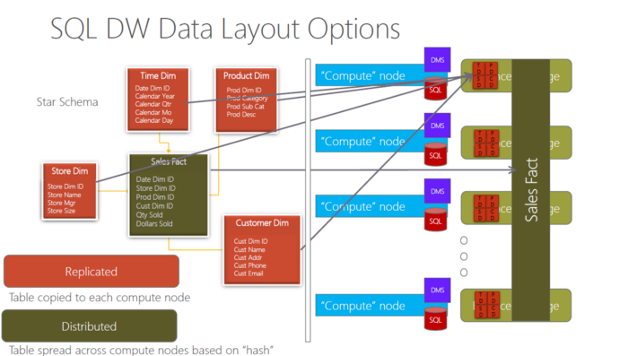

## A Quick, non-powerpoint, Overview of Synapse

Here is the architecture:  

Data needs to be distributed:
* the best practice is to distribute based on the key used in the most joins

Here's one way to think about this:  

Indexes are the next consideration: 
* Clustered columnstore indexes (CCI is the default)
  * a table needs about 60 million rows to really benefit from CCI (data is split into 60 distributions @ 1 million rows/distribution (before CCI segmenting kicks in))
  * and then if you partition you are further limiting the number of rows available before CCI segmenting kicks in.  Imagine your table has 100 partitions...you will need 6 billion rows before you'll see perf improvements from CCI (60 distributions * 100 partitions * 1 million rows)
* heap (might be good for data loading in some cases;transient ETL data)

Partitions are the next consideration:
* when in doubt, partition by date
* we want to leverage "partition elimination" as much as possible

### "Just give me the best practices"

* Huge fact tables
  * hash distributed CCI with partitioning if you are sure each partition will have 1 million rows (see above).  Otherwise, don't partition
* Dims < 60 m rows and > 1 million rows
  * hash distributed heap
  * CCI will have no benefit here, rowstore is better
* small dims (<2GB)
  * replicated table

## What workloads are no suitable?

